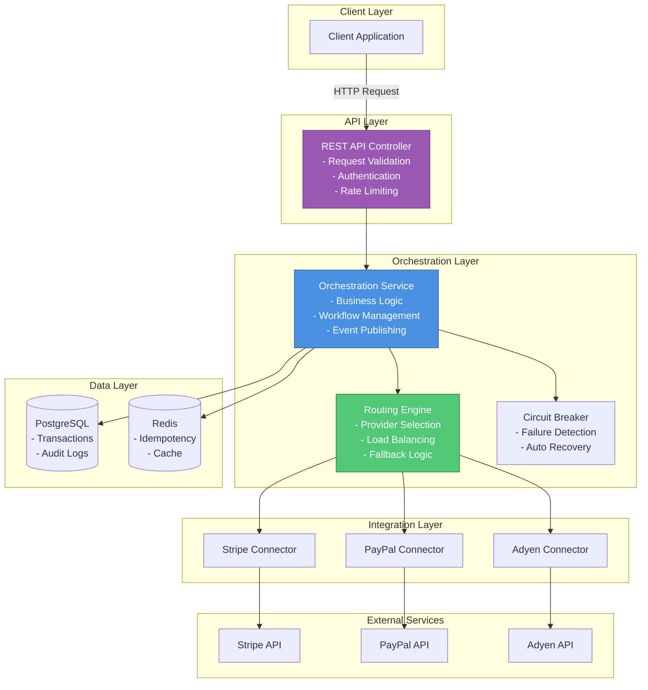
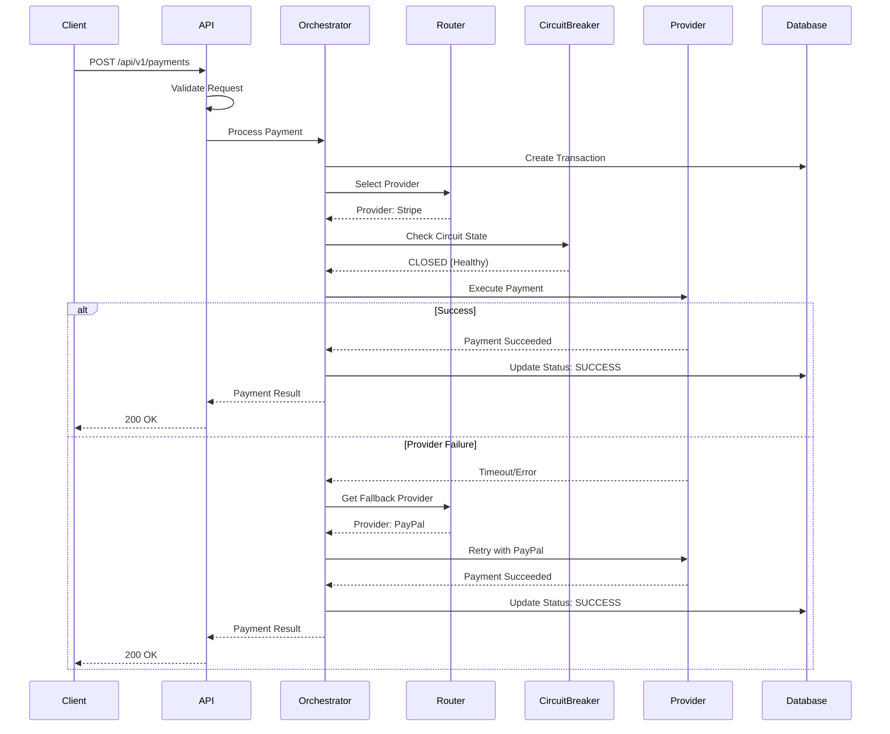

# Payment Orchestration System

🌐 **[View Interactive Architecture →](https://htmlpreview.github.io/?https://github.com/kartik4042/payment-service-layer/blob/main/index.html)**

> A production-ready payment orchestration platform that abstracts payment complexity and provides a unified interface for processing payments across multiple payment service providers.

[](https://kotlinlang.org/)
[](https://spring.io/projects/spring-boot)
[](LICENSE)
[](src/test)

---

## 📋 Table of Contents

- [What is Payment Orchestration?](#what-is-payment-orchestration)
- [Key Features](#key-features)
- [Architecture Overview](#architecture-overview)
- [Technology Stack](#technology-stack)
- [Getting Started](#getting-started)
- [Project Structure](#project-structure)
- [API Examples](#api-examples)
- [Testing](#testing)
- [Monitoring & Observability](#monitoring--observability)
- [Documentation](#documentation)
- [Contributing](#contributing)

---

## 🎯 What is Payment Orchestration?

Payment orchestration is a layer that sits between your business applications and multiple payment service providers (PSPs) like Stripe, PayPal, and Adyen. It provides:

- **Single Integration Point**: One API for all payment operations
- **Intelligent Routing**: Automatically route payments to the best provider
- **Automatic Failover**: Retry failed payments with alternative providers
- **Provider Abstraction**: Switch providers without changing your code
- **Cost Optimization**: Route to lowest-cost provider when appropriate

### Business Problem Solved

Modern businesses need to:
- Integrate with multiple payment providers (Stripe, PayPal, Adyen, etc.)
- Handle provider outages gracefully
- Optimize payment costs
- Comply with regional regulations
- Maintain high availability (99.99%+)

This system solves these challenges by providing an intelligent orchestration layer.

---

## ✨ Key Features

### Core Capabilities
- ✅ **Multi-Provider Support**: Stripe, PayPal, Adyen, and more
- ✅ **Intelligent Routing**: Geographic, cost-based, and performance-based routing
- ✅ **Circuit Breaker**: Automatic provider isolation on failures
- ✅ **Idempotency**: Guaranteed exactly-once payment processing
- ✅ **Webhook Handling**: Secure HMAC-SHA256 signature verification
- ✅ **Health Monitoring**: Real-time provider health checks

### Advanced Features
- ✅ **Event Publishing**: 12 domain events for downstream consumers
- ✅ **Audit Logging**: Complete audit trail with 7-year retention
- ✅ **Bulk Operations**: Batch retry for failed payments
- ✅ **Observability**: Prometheus metrics + Zipkin distributed tracing
- ✅ **Performance**: Validated 1000 TPS capacity

---

## 🏗️ Architecture Overview

### High-Level Architecture



### Payment Flow Sequence



---

## 🛠️ Technology Stack

### Backend
- **Language**: Kotlin 1.9+
- **Framework**: Spring Boot 3.2+
- **Build Tool**: Gradle 8.5+
- **JVM**: Java 17+

### Data Storage
- **Primary Database**: PostgreSQL 14+
- **Cache**: Redis 7+
- **Message Queue**: Spring Events (in-memory) / Kafka (optional)

### Resilience & Reliability
- **Circuit Breaker**: Resilience4j
- **Retry Logic**: Exponential backoff with jitter
- **Health Checks**: Spring Boot Actuator

### Observability
- **Metrics**: Prometheus + Micrometer
- **Distributed Tracing**: Spring Cloud Sleuth + Zipkin
- **Logging**: SLF4J + Logback (JSON format)

### Testing
- **Unit Tests**: JUnit 5 + MockK
- **Integration Tests**: Spring Boot Test + Testcontainers
- **Performance Tests**: Gatling
- **API Tests**: REST Assured

### Security
- **Authentication**: JWT / OAuth 2.0
- **Encryption**: TLS 1.3
- **Webhook Verification**: HMAC-SHA256

---

## 🚀 Getting Started

### Prerequisites

Before you begin, ensure you have the following installed:

- **Java 17+**: [Download](https://adoptium.net/)
- **Docker & Docker Compose**: [Download](https://www.docker.com/get-started)
- **Gradle 8.5+**: (included via wrapper - `./gradlew`)

### Quick Start with Docker Compose (Recommended)

The fastest way to get started is using Docker Compose, which sets up all required infrastructure:

```bash
# 1. Clone the repository
git clone https://github.com/your-org/payment-orchestration.git
cd payment-orchestration/payment

# 2. Copy environment configuration
cp .env.example .env
# Edit .env with your provider API keys if needed

# 3. Start all services (PostgreSQL, Redis, Zipkin, Prometheus, Grafana)
docker-compose up -d

# 4. Verify services are running
docker-compose ps

# 5. Build the application
./gradlew clean build

# 6. Run the application
./gradlew bootRun
```

The application will start on `http://localhost:8080`

### Access Services

Once running, you can access:

| Service | URL | Credentials |
|---------|-----|-------------|
| **Application API** | http://localhost:8080 | - |
| **Prometheus** | http://localhost:9090 | - |
| **Grafana** | http://localhost:3000 | admin/admin |
| **Zipkin** | http://localhost:9411 | - |
| **PostgreSQL** | localhost:5432 | postgres/postgres |
| **Redis** | localhost:6379 | - |

### Manual Installation

If you prefer to set up services manually:

#### 1. Install PostgreSQL

```bash
# macOS (using Homebrew)
brew install postgresql@14
brew services start postgresql@14

# Ubuntu/Debian
sudo apt-get install postgresql-14
sudo systemctl start postgresql

# Create database
createdb payment_orchestration
```

#### 2. Install Redis

```bash
# macOS
brew install redis
brew services start redis

# Ubuntu/Debian
sudo apt-get install redis-server
sudo systemctl start redis
```

#### 3. Configure Application

Create `application-local.yml`:

```yaml
spring:
  datasource:
    url: jdbc:postgresql://localhost:5432/payment_orchestration
    username: postgres
    password: your_password
  
  redis:
    host: localhost
    port: 6379

# Provider API Keys (use test keys)
providers:
  stripe:
    api-key: sk_test_your_stripe_key
  paypal:
    client-id: your_paypal_client_id
    client-secret: your_paypal_secret
```

#### 4. Run Database Migrations

```bash
./gradlew flywayMigrate
```

#### 5. Start the Application

```bash
./gradlew bootRun --args='--spring.profiles.active=local'
```

### Verify Installation

Check if the application is running:

```bash
# Health check
curl http://localhost:8080/actuator/health

# Expected response:
# {"status":"UP"}
```

---

## 📁 Project Structure

```
payment/
├── src/
│   ├── main/
│   │   ├── kotlin/com/payment/orchestration/
│   │   │   ├── api/                    # REST API Controllers
│   │   │   │   ├── controller/         # HTTP endpoints
│   │   │   │   └── dto/                # Request/Response DTOs
│   │   │   │
│   │   │   ├── domain/                 # Domain Models
│   │   │   │   ├── model/              # Core entities
│   │   │   │   └── repository/         # Data access
│   │   │   │
│   │   │   ├── service/                # Business Logic
│   │   │   │   ├── PaymentOrchestrationService.kt
│   │   │   │   ├── RoutingEngine.kt
│   │   │   │   └── IdempotencyService.kt
│   │   │   │
│   │   │   ├── provider/               # Provider Connectors
│   │   │   │   ├── StripeConnector.kt
│   │   │   │   ├── PayPalConnector.kt
│   │   │   │   └── AdyenConnector.kt
│   │   │   │
│   │   │   ├── circuitbreaker/         # Resilience Patterns
│   │   │   │   └── CircuitBreakerService.kt
│   │   │   │
│   │   │   ├── webhook/                # Webhook Handling
│   │   │   │   └── WebhookController.kt
│   │   │   │
│   │   │   ├── health/                 # Health Monitoring
│   │   │   │   └── ProviderHealthService.kt
│   │   │   │
│   │   │   ├── routing/                # Geographic Routing
│   │   │   │   └── GeographicRoutingService.kt
│   │   │   │
│   │   │   ├── metrics/                # Observability
│   │   │   │   └── PaymentMetricsService.kt
│   │   │   │
│   │   │   ├── events/                 # Event Publishing
│   │   │   │   └── PaymentEventPublisher.kt
│   │   │   │
│   │   │   ├── audit/                  # Audit Logging
│   │   │   │   └── AuditEventService.kt
│   │   │   │
│   │   │   └── retry/                  # Bulk Retry
│   │   │       └── BulkRetryService.kt
│   │   │
│   │   └── resources/
│   │       ├── application.yml         # Production configuration
│   │       ├── application-test.yml    # Test configuration
│   │       └── db/migration/           # Flyway migrations
│   │
│   └── test/
│       ├── kotlin/com/payment/orchestration/
│       │   ├── service/                # Unit tests
│       │   ├── integration/            # Integration tests
│       │   └── performance/            # Performance tests
│       │
│       └── resources/
│           └── application-test.yml    # Test configuration
│
├── docs/                               # Documentation
│   ├── ARCHITECTURE_OVERVIEW.md        # System architecture (812 lines)
│   ├── API_DESIGN.md                   # API reference
│   ├── ORCHESTRATION_LOGIC.md          # Payment flow (683 lines)
│   ├── DATABASE_SCHEMA.md              # Schema design (1,358 lines)
│   ├── SRE_METRICS.md                  # Monitoring & SLOs
│   ├── TEST_STRATEGY.md                # Testing approach
│   ├── DEPLOYMENT_GUIDE.md             # Deployment guide (632 lines)
│   ├── AI_DEVELOPMENT_GUIDE.md         # AI development process (1,247 lines)
│   └── DESIGN_REVIEW.md                # Staff+ review (1,416 lines)
│
├── docker-compose.yml                  # Docker orchestration (PostgreSQL, Redis, Zipkin, Prometheus, Grafana)
├── Dockerfile                          # Multi-stage production build
├── .dockerignore                       # Docker build optimization
├── prometheus.yml                      # Prometheus configuration
├── .env.example                        # Environment variables template
├── build.gradle.kts                    # Gradle build configuration
└── README.md                           # This file
```

---

## 🔌 API Examples

### 1. Create Payment

Process a payment through the orchestration system:

```bash
curl -X POST http://localhost:8080/api/v1/payments \
  -H "Content-Type: application/json" \
  -H "Authorization: Bearer YOUR_JWT_TOKEN" \
  -d '{
    "amount": 10000,
    "currency": "USD",
    "customerId": "cust_123",
    "paymentMethod": "CARD",
    "card": {
      "token": "tok_visa_4242"
    },
    "idempotencyKey": "unique_key_123",
    "metadata": {
      "orderId": "order_456",
      "description": "Premium subscription"
    }
  }'
```

**Response (200 OK):**
```json
{
  "transactionId": "txn_abc123",
  "status": "SUCCEEDED",
  "provider": "STRIPE",
  "amount": 10000,
  "currency": "USD",
  "providerTransactionId": "ch_1234567890",
  "createdAt": "2026-04-09T05:00:00Z",
  "completedAt": "2026-04-09T05:00:02Z"
}
```

### 2. Get Payment Status

Retrieve the current status of a payment:

```bash
curl -X GET http://localhost:8080/api/v1/payments/txn_abc123 \
  -H "Authorization: Bearer YOUR_JWT_TOKEN"
```

**Response (200 OK):**
```json
{
  "transactionId": "txn_abc123",
  "status": "SUCCEEDED",
  "provider": "STRIPE",
  "amount": 10000,
  "currency": "USD",
  "customerId": "cust_123",
  "paymentMethod": "CARD",
  "providerTransactionId": "ch_1234567890",
  "createdAt": "2026-04-09T05:00:00Z",
  "updatedAt": "2026-04-09T05:00:02Z",
  "completedAt": "2026-04-09T05:00:02Z",
  "events": [
    {
      "eventType": "PAYMENT_INITIATED",
      "timestamp": "2026-04-09T05:00:00Z"
    },
    {
      "eventType": "PAYMENT_ROUTED",
      "provider": "STRIPE",
      "timestamp": "2026-04-09T05:00:01Z"
    },
    {
      "eventType": "PAYMENT_SUCCEEDED",
      "timestamp": "2026-04-09T05:00:02Z"
    }
  ]
}
```

### 3. Webhook Endpoint

Receive provider webhooks (e.g., from Stripe):

```bash
curl -X POST http://localhost:8080/api/v1/webhooks/stripe \
  -H "Content-Type: application/json" \
  -H "Stripe-Signature: t=1234567890,v1=signature_here" \
  -d '{
    "id": "evt_123",
    "type": "charge.succeeded",
    "data": {
      "object": {
        "id": "ch_1234567890",
        "amount": 10000,
        "status": "succeeded"
      }
    }
  }'
```

**Response (200 OK):**
```json
{
  "received": true,
  "eventId": "evt_123"
}
```

### 4. Provider Health Check

Check the health status of all payment providers:

```bash
curl -X GET http://localhost:8080/api/v1/health/providers \
  -H "Authorization: Bearer YOUR_JWT_TOKEN"
```

**Response (200 OK):**
```json
{
  "providers": [
    {
      "provider": "STRIPE",
      "status": "HEALTHY",
      "uptime": 99.98,
      "lastCheckTime": "2026-04-09T05:00:00Z",
      "responseTime": 245,
      "circuitBreakerState": "CLOSED"
    },
    {
      "provider": "PAYPAL",
      "status": "HEALTHY",
      "uptime": 99.95,
      "lastCheckTime": "2026-04-09T05:00:00Z",
      "responseTime": 312,
      "circuitBreakerState": "CLOSED"
    }
  ]
}
```

### 5. Bulk Retry Failed Payments

Retry multiple failed payments in batch:

```bash
curl -X POST http://localhost:8080/api/v1/retry/bulk \
  -H "Content-Type: application/json" \
  -H "Authorization: Bearer YOUR_JWT_TOKEN" \
  -d '{
    "statuses": ["FAILED"],
    "provider": "STRIPE",
    "startTime": "2026-04-08T00:00:00Z",
    "endTime": "2026-04-09T00:00:00Z",
    "batchSize": 100
  }'
```

**Response (202 Accepted):**
```json
{
  "jobId": "bulk_retry_1234567890_5678",
  "message": "Bulk retry job started",
  "statusUrl": "/api/v1/retry/bulk/bulk_retry_1234567890_5678"
}
```

### 6. Get Audit Events

Retrieve audit trail for a payment:

```bash
curl -X GET http://localhost:8080/api/v1/audit/payments/txn_abc123/events \
  -H "Authorization: Bearer YOUR_JWT_TOKEN"
```

**Response (200 OK):**
```json
{
  "transactionId": "txn_abc123",
  "events": [
    {
      "eventId": "evt_001",
      "eventType": "PAYMENT_INITIATED",
      "timestamp": "2026-04-09T05:00:00Z",
      "actor": "api_client_123",
      "ipAddress": "192.168.1.100",
      "payload": {
        "amount": 10000,
        "currency": "USD"
      }
    },
    {
      "eventId": "evt_002",
      "eventType": "PAYMENT_ROUTED",
      "timestamp": "2026-04-09T05:00:01Z",
      "provider": "STRIPE",
      "routingReason": "geographic_preference"
    },
    {
      "eventId": "evt_003",
      "eventType": "PAYMENT_SUCCEEDED",
      "timestamp": "2026-04-09T05:00:02Z",
      "provider": "STRIPE",
      "providerTransactionId": "ch_1234567890"
    }
  ]
}
```

---

## 🧪 Testing

### Running Tests

```bash
# Run all tests
./gradlew test

# Run specific test suite
./gradlew test --tests "com.payment.orchestration.service.*"

# Run integration tests
./gradlew integrationTest

# Run with coverage report
./gradlew test jacocoTestReport
```

### Test Categories

#### 1. Unit Tests (240+ tests)
```bash
# Test routing logic
./gradlew test --tests "*RoutingEngineTest"

# Test retry manager
./gradlew test --tests "*RetryManagerTest"

# Test idempotency
./gradlew test --tests "*IdempotencyServiceTest"
```

#### 2. Integration Tests
```bash
# End-to-end payment flow
./gradlew integrationTest --tests "*PaymentOrchestrationIntegrationTest"

# Provider failover
./gradlew integrationTest --tests "*ProviderFailoverTest"
```

#### 3. Performance Tests
```bash
# Run Gatling performance tests
./gradlew gatlingRun

# Scenarios tested:
# - Normal load (100 TPS)
# - Peak load (1000 TPS)
# - Stress test (2000 TPS)
# - Spike test
# - Endurance test (1 hour)
```

### Test Coverage

Current test coverage:
- **Overall**: 85%+
- **Service Layer**: 90%+
- **API Controllers**: 80%+
- **Domain Models**: 95%+

View coverage report:
```bash
./gradlew jacocoTestReport
open build/reports/jacoco/test/html/index.html
```

---

## 📊 Monitoring & Observability

### Metrics (Prometheus)

Access Prometheus metrics:
```bash
curl http://localhost:8080/actuator/prometheus
```

**Key Metrics:**
- `payment_requests_total` - Total payment requests
- `payment_request_duration_seconds` - Request latency (P50, P95, P99)
- `payment_errors_total` - Error count by type
- `provider_success_rate` - Success rate per provider
- `circuit_breaker_state` - Circuit breaker state per provider

### Distributed Tracing (Zipkin)

View traces in Zipkin UI:
```
http://localhost:9411
```

Each payment request generates a trace showing:
- Request flow through all components
- Provider API calls
- Database queries
- Cache operations
- Total latency breakdown

### Health Checks

```bash
# Application health
curl http://localhost:8080/actuator/health

# Detailed health (includes DB, Redis, providers)
curl http://localhost:8080/actuator/health/details
```

### Logs

Logs are output in JSON format for easy parsing:

```bash
# View logs
tail -f logs/application.log

# Search for specific transaction
grep "txn_abc123" logs/application.log | jq
```

---

## 📚 Documentation

Comprehensive documentation is available in the `docs/` directory:

| Document | Lines | Description |
|----------|-------|-------------|
| [ARCHITECTURE_OVERVIEW.md](docs/ARCHITECTURE_OVERVIEW.md) | 812 | System architecture, design decisions, and Mermaid diagrams |
| [API_DESIGN.md](docs/API_DESIGN.md) | 450+ | Complete API reference with request/response examples |
| [ORCHESTRATION_LOGIC.md](docs/ORCHESTRATION_LOGIC.md) | 683 | Payment orchestration flow, error handling, and Kotlin examples |
| [DATABASE_SCHEMA.md](docs/DATABASE_SCHEMA.md) | 1,358 | Database schema, indexes, and data access patterns |
| [SRE_METRICS.md](docs/SRE_METRICS.md) | 600+ | SRE metrics, SLOs, alerting, and monitoring dashboards |
| [TEST_STRATEGY.md](docs/TEST_STRATEGY.md) | 500+ | Testing strategy, test pyramid, and coverage goals |
| [DEPLOYMENT_GUIDE.md](docs/DEPLOYMENT_GUIDE.md) | 632 | Local, Docker, AWS ECS, and Kubernetes deployment |
| [AI_DEVELOPMENT_GUIDE.md](docs/AI_DEVELOPMENT_GUIDE.md) | 1,247 | Complete AI-augmented development process and prompts |
| [DESIGN_REVIEW.md](docs/DESIGN_REVIEW.md) | 1,416 | Staff+ production readiness review and recommendations |

**Total Documentation**: 6,500+ lines covering architecture, implementation, deployment, and operations.

---

## 🤝 Contributing

We welcome contributions! Please follow these steps:

1. **Fork the repository**
2. **Create a feature branch**: `git checkout -b feature/amazing-feature`
3. **Make your changes**
4. **Run tests**: `./gradlew test`
5. **Commit your changes**: `git commit -m 'Add amazing feature'`
6. **Push to the branch**: `git push origin feature/amazing-feature`
7. **Open a Pull Request**

### Code Style

- Follow [Kotlin Coding Conventions](https://kotlinlang.org/docs/coding-conventions.html)
- Use meaningful variable and function names
- Add KDoc comments for public APIs
- Write tests for new features

### Pull Request Checklist

- [ ] Tests pass locally
- [ ] Code follows style guidelines
- [ ] Documentation updated
- [ ] Changelog updated
- [ ] No breaking changes (or documented)

---

## 📝 License

This project is licensed under the MIT License - see the [LICENSE](LICENSE) file for details.

---

## 🙋 Support

### Getting Help

- **Documentation**: Check the [docs/](docs/) directory
- **Issues**: [GitHub Issues](https://github.com/your-org/payment-orchestration/issues)
- **Discussions**: [GitHub Discussions](https://github.com/your-org/payment-orchestration/discussions)
- **Email**: support@your-org.com

### Reporting Bugs

When reporting bugs, please include:
- Kotlin/Java version
- Spring Boot version
- Steps to reproduce
- Expected vs actual behavior
- Relevant logs

---

## 🎉 Acknowledgments

Built with:
- [Spring Boot](https://spring.io/projects/spring-boot)
- [Kotlin](https://kotlinlang.org/)
- [Resilience4j](https://resilience4j.readme.io/)
- [Prometheus](https://prometheus.io/)
- [Zipkin](https://zipkin.io/)

---

**Made with ❤️ by the Payment Orchestration Team**

*Last Updated: 2026-04-09*
