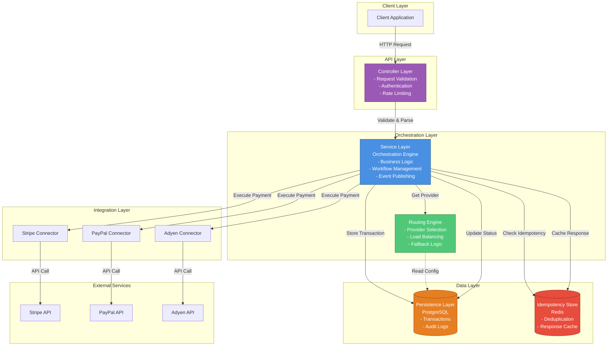
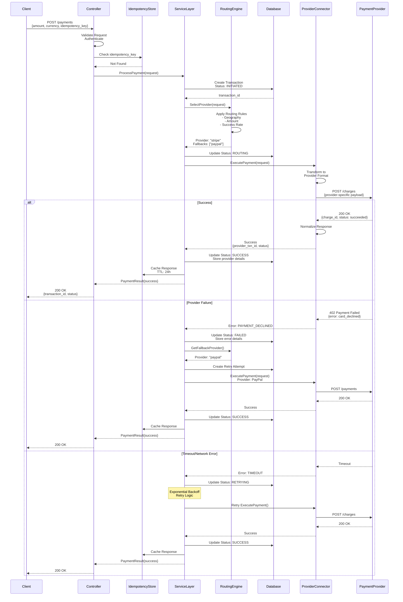

# Payment Orchestration System - Architecture Overview

## Executive Summary

This document outlines the architecture of a simplified Payment Orchestration System designed to abstract payment complexity and provide a unified interface for processing payments across multiple payment service providers (PSPs).

---

## 1. Business Problem Being Solved

### Core Challenges

**Multi-Provider Complexity**
- Modern businesses need to integrate with multiple payment providers (Stripe, PayPal, Adyen, etc.)
- Each provider has different APIs, authentication mechanisms, and data formats
- Direct integration creates tight coupling and maintenance overhead

**Operational Requirements**
- **High Availability**: Payment failures directly impact revenue
- **Smart Routing**: Route transactions to optimal providers based on cost, success rates, geography
- **Failover Capability**: Automatically retry failed transactions with alternative providers
- **Compliance**: Handle PCI-DSS, regional regulations, and data residency requirements

**Business Flexibility**
- Ability to add/remove payment providers without code changes
- A/B testing different providers
- Cost optimization through dynamic routing
- Vendor negotiation leverage

### Value Proposition

The orchestration layer provides:
- **Single Integration Point**: One API for all payment operations
- **Provider Abstraction**: Business logic decoupled from provider specifics
- **Intelligent Routing**: Optimize for cost, success rate, and business rules
- **Resilience**: Automatic failover and retry mechanisms
- **Observability**: Centralized monitoring and analytics

---

## 2. Role of the Orchestration Layer

### Strategic Position

The orchestration layer sits between your business applications and payment service providers, acting as an intelligent middleware that:

```
Business Applications
        ↓
   [API Gateway]
        ↓
 ╔═══════════════════════════════════╗
 ║   PAYMENT ORCHESTRATION LAYER     ║
 ║                                   ║
 ║  • Request Normalization          ║
 ║  • Provider Selection             ║
 ║  • Routing Logic                  ║
 ║  • Failover Management            ║
 ║  • Response Transformation        ║
 ║  • State Management               ║
 ╚═══════════════════════════════════╝
        ↓
   [Provider Connectors]
        ↓
  Stripe | PayPal | Adyen | Square
```

### Key Responsibilities

1. **Protocol Translation**: Convert between internal models and provider-specific formats
2. **Routing Intelligence**: Select optimal provider based on configurable rules
3. **State Management**: Track transaction lifecycle across providers
4. **Idempotency**: Ensure exactly-once processing semantics
5. **Error Handling**: Normalize errors and implement retry strategies
6. **Observability**: Emit metrics, logs, and traces for monitoring

---

## 3. Architectural Components

### 3.1 Controller Layer (API Gateway)

**Purpose**: Entry point for all payment requests; handles HTTP concerns

**Responsibilities**:
- **Request Validation**: Schema validation, authentication, authorization
- **Rate Limiting**: Protect downstream services from overload
- **Request Parsing**: Extract and validate payment parameters
- **Response Formatting**: Transform internal responses to API contracts
- **Error Handling**: Convert internal errors to HTTP status codes and messages

**Input**:
```json
POST /api/v1/payments
{
  "amount": 10000,
  "currency": "USD",
  "customer_id": "cust_123",
  "payment_method": "card",
  "idempotency_key": "unique_key_123"
}
```

**Output**:
```json
{
  "transaction_id": "txn_abc123",
  "status": "processing",
  "provider": "stripe",
  "created_at": "2026-04-09T05:00:00Z"
}
```

**Key Patterns**:
- RESTful API design
- JWT-based authentication
- Request/Response DTOs (Data Transfer Objects)
- Middleware chain for cross-cutting concerns

---

### 3.2 Service Layer (Orchestration Engine)

**Purpose**: Core business logic; coordinates the payment workflow

**Responsibilities**:
- **Workflow Orchestration**: Manage multi-step payment processes
- **Business Rule Execution**: Apply payment policies and validations
- **Transaction State Management**: Track payment lifecycle
- **Idempotency Enforcement**: Prevent duplicate processing
- **Audit Logging**: Record all payment operations
- **Event Publishing**: Emit domain events for downstream consumers

**Key Operations**:

1. **Process Payment**
   - Input: Normalized payment request
   - Process: Validate → Route → Execute → Persist
   - Output: Transaction result with provider details

2. **Handle Callback**
   - Input: Provider webhook/callback
   - Process: Verify → Update state → Notify
   - Output: Acknowledgment

3. **Query Transaction**
   - Input: Transaction ID
   - Process: Retrieve from persistence
   - Output: Current transaction state

**State Machine**:
```
INITIATED → ROUTING → PROCESSING → [SUCCESS | FAILED | PENDING]
                ↓
            RETRYING (on failure)
                ↓
            FALLBACK (to alternate provider)
```

**Design Patterns**:
- **Strategy Pattern**: Pluggable routing strategies
- **Chain of Responsibility**: Validation and processing pipeline
- **State Pattern**: Transaction lifecycle management
- **Observer Pattern**: Event notification

---

### 3.3 Routing Engine

**Purpose**: Intelligent provider selection based on configurable rules

**Responsibilities**:
- **Provider Selection**: Choose optimal PSP for each transaction
- **Load Balancing**: Distribute load across providers
- **Cost Optimization**: Route to lowest-cost provider when appropriate
- **Geographic Routing**: Select providers based on customer location
- **Fallback Logic**: Define backup providers for failures

**Routing Strategies**:

1. **Rule-Based Routing**
   ```
   IF currency = "EUR" AND country = "DE" THEN provider = "Adyen"
   IF amount > 100000 THEN provider = "Stripe"
   IF customer_tier = "premium" THEN provider = "Primary"
   ```

2. **Performance-Based Routing**
   - Success rate thresholds
   - Average response time
   - Provider health checks

3. **Cost-Based Routing**
   - Transaction fee comparison
   - Volume-based pricing tiers
   - Currency conversion costs

4. **Weighted Round-Robin**
   - A/B testing scenarios
   - Gradual provider migration

**Input**:
```typescript
{
  amount: 10000,
  currency: "USD",
  country: "US",
  payment_method: "card",
  customer_tier: "standard"
}
```

**Output**:
```typescript
{
  primary_provider: "stripe",
  fallback_providers: ["paypal", "adyen"],
  routing_reason: "geographic_preference",
  estimated_cost: 290  // basis points
}
```

**Configuration Example**:
```yaml
routing_rules:
  - name: "EU_Transactions"
    conditions:
      - field: "country"
        operator: "in"
        values: ["DE", "FR", "IT"]
    provider: "adyen"
    priority: 1
  
  - name: "High_Value"
    conditions:
      - field: "amount"
        operator: ">"
        value: 100000
    provider: "stripe"
    priority: 2
```

---

### 3.4 Provider Connectors

**Purpose**: Adapter layer for payment service provider integration

**Responsibilities**:
- **Protocol Adaptation**: Transform internal models to provider APIs
- **Authentication**: Manage API keys, OAuth tokens, certificates
- **Request Execution**: Make HTTP calls to provider endpoints
- **Response Parsing**: Convert provider responses to internal format
- **Error Normalization**: Map provider errors to standard error codes
- **Retry Logic**: Handle transient failures with exponential backoff

**Connector Interface** (Conceptual):
```typescript
interface PaymentProviderConnector {
  // Core operations
  processPayment(request: PaymentRequest): Promise<PaymentResponse>
  capturePayment(transactionId: string): Promise<CaptureResponse>
  refundPayment(transactionId: string, amount?: number): Promise<RefundResponse>
  
  // Query operations
  getTransactionStatus(transactionId: string): Promise<TransactionStatus>
  
  // Webhook handling
  verifyWebhook(payload: string, signature: string): boolean
  parseWebhook(payload: string): WebhookEvent
}
```

**Provider-Specific Implementations**:

1. **Stripe Connector**
   - Uses Stripe SDK
   - Handles 3D Secure flows
   - Manages customer and payment method objects

2. **PayPal Connector**
   - OAuth 2.0 authentication
   - Order creation and capture flow
   - Handles PayPal-specific redirect flows

3. **Adyen Connector**
   - HMAC signature verification
   - Supports multiple payment methods
   - Handles async payment flows

**Error Mapping**:
```
Provider Error → Internal Error Code
─────────────────────────────────────
Stripe: card_declined → PAYMENT_DECLINED
PayPal: INSUFFICIENT_FUNDS → INSUFFICIENT_FUNDS
Adyen: fraud → FRAUD_DETECTED
```

**Input** (Internal Model):
```typescript
{
  amount: 10000,
  currency: "USD",
  payment_method: {
    type: "card",
    token: "tok_visa_4242"
  },
  metadata: {
    order_id: "ord_123",
    customer_id: "cust_456"
  }
}
```

**Output** (Internal Model):
```typescript
{
  provider_transaction_id: "ch_1234567890",
  status: "succeeded",
  amount_captured: 10000,
  fees: 290,
  created_at: "2026-04-09T05:00:00Z"
}
```

---

### 3.5 Persistence Layer

**Purpose**: Durable storage for transaction data and system state

**Responsibilities**:
- **Transaction Storage**: Store all payment attempts and results
- **Audit Trail**: Maintain immutable history of all operations
- **Query Support**: Enable transaction lookups and reporting
- **Data Consistency**: Ensure ACID properties for critical operations
- **Archival**: Manage data retention and compliance requirements

**Data Models**:

1. **Transaction Entity**
   ```
   - transaction_id (PK)
   - idempotency_key (Unique)
   - amount
   - currency
   - status (enum)
   - provider
   - provider_transaction_id
   - customer_id
   - payment_method
   - created_at
   - updated_at
   - metadata (JSON)
   ```

2. **Transaction Event Log**
   ```
   - event_id (PK)
   - transaction_id (FK)
   - event_type (enum: created, routed, processing, succeeded, failed)
   - provider
   - timestamp
   - payload (JSON)
   - error_details (JSON, nullable)
   ```

3. **Provider Configuration**
   ```
   - provider_id (PK)
   - provider_name
   - api_credentials (encrypted)
   - enabled (boolean)
   - priority
   - configuration (JSON)
   ```

**Storage Strategy**:
- **Primary Database**: PostgreSQL for transactional data
  - ACID compliance
  - Complex queries and joins
  - Strong consistency

- **Event Store**: Append-only log for audit trail
  - Immutable history
  - Event sourcing capability
  - Compliance and debugging

- **Cache Layer**: Redis for hot data
  - Idempotency keys (TTL: 24 hours)
  - Provider health status
  - Routing decisions

**Query Patterns**:
```sql
-- Get transaction by ID
SELECT * FROM transactions WHERE transaction_id = ?

-- Get transaction by idempotency key
SELECT * FROM transactions WHERE idempotency_key = ?

-- Get transaction history
SELECT * FROM transaction_events 
WHERE transaction_id = ? 
ORDER BY timestamp ASC

-- Provider performance metrics
SELECT provider, 
       COUNT(*) as total,
       SUM(CASE WHEN status = 'succeeded' THEN 1 ELSE 0 END) as successful
FROM transactions
WHERE created_at > NOW() - INTERVAL '1 hour'
GROUP BY provider
```

---

### 3.6 Idempotency Store

**Purpose**: Ensure exactly-once processing semantics for payment requests

**Responsibilities**:
- **Duplicate Detection**: Identify repeated requests with same idempotency key
- **Response Caching**: Return cached response for duplicate requests
- **TTL Management**: Expire idempotency keys after reasonable time window
- **Atomic Operations**: Ensure thread-safe key creation and lookup

**Why Idempotency Matters**:
- Network failures can cause client retries
- Duplicate charges damage customer trust
- Financial reconciliation becomes complex
- Compliance and audit requirements

**Implementation Strategy**:

1. **Key Generation**
   - Client provides idempotency key (recommended)
   - Or system generates from request hash

2. **Storage**
   - Redis with TTL (24 hours typical)
   - Key: idempotency_key
   - Value: {transaction_id, status, response, timestamp}

3. **Processing Flow**
   ```
   1. Check if idempotency_key exists
   2. If exists:
      - Return cached response
      - Log duplicate attempt
   3. If not exists:
      - Create key with "processing" status
      - Process payment
      - Update key with result
      - Return response
   ```

**Data Structure**:
```typescript
{
  idempotency_key: "unique_key_123",
  transaction_id: "txn_abc123",
  status: "completed",
  response: {
    // Full API response
  },
  created_at: "2026-04-09T05:00:00Z",
  ttl: 86400  // 24 hours
}
```

**Edge Cases Handled**:
- Concurrent requests with same key (use Redis SETNX)
- Key expiration during processing (extend TTL)
- Partial failures (store intermediate state)

---

## 4. Component Interaction Flow

### Request Flow (Happy Path)

```
1. Client → Controller: POST /payments with idempotency_key
2. Controller → Idempotency Store: Check key
3. Idempotency Store → Controller: Key not found
4. Controller → Service Layer: Process payment request
5. Service Layer → Routing Engine: Get provider
6. Routing Engine → Service Layer: Return "stripe"
7. Service Layer → Persistence: Create transaction record
8. Service Layer → Provider Connector (Stripe): Execute payment
9. Stripe Connector → Stripe API: HTTP POST
10. Stripe API → Stripe Connector: Success response
11. Stripe Connector → Service Layer: Normalized response
12. Service Layer → Persistence: Update transaction status
13. Service Layer → Idempotency Store: Cache response
14. Service Layer → Controller: Return result
15. Controller → Client: HTTP 200 with transaction details
```

### Failure and Retry Flow

```
1. Provider Connector → Stripe API: Payment request
2. Stripe API → Provider Connector: Timeout (no response)
3. Provider Connector → Service Layer: Transient error
4. Service Layer → Routing Engine: Get fallback provider
5. Routing Engine → Service Layer: Return "paypal"
6. Service Layer → Provider Connector (PayPal): Retry payment
7. PayPal Connector → PayPal API: Payment request
8. PayPal API → PayPal Connector: Success
9. Service Layer → Persistence: Update with PayPal details
10. Service Layer → Controller: Return success
```

---

## 5. Architecture Diagrams

### 5.1 System Architecture Diagram



### 5.2 Payment Flow Sequence Diagram



---

## 6. Key Design Decisions & Rationale

### 6.1 Synchronous vs Asynchronous Processing

**Decision**: Hybrid approach
- Synchronous for immediate payment confirmation (cards)
- Asynchronous for delayed methods (bank transfers, wallets)

**Rationale**:
- User experience: Customers expect instant feedback for cards
- Provider constraints: Some methods are inherently async
- Webhook handling: Async updates for final settlement

### 6.2 Database Choice

**Decision**: PostgreSQL for primary storage, Redis for caching

**Rationale**:
- ACID compliance for financial data
- Complex query support for reporting
- JSON support for flexible metadata
- Redis for high-speed idempotency checks

### 6.3 Provider Abstraction Level

**Decision**: Thin adapter layer, not full abstraction

**Rationale**:
- Preserve provider-specific features when needed
- Avoid lowest-common-denominator limitations
- Allow gradual migration and A/B testing
- Easier to add new providers

### 6.4 Routing Strategy

**Decision**: Rule-based with performance metrics

**Rationale**:
- Business rules change frequently (need flexibility)
- Performance data informs routing decisions
- Gradual rollout of new providers
- Cost optimization opportunities

### 6.5 Idempotency Implementation

**Decision**: Client-provided keys with server-side enforcement

**Rationale**:
- Client controls retry semantics
- Server ensures exactly-once processing
- 24-hour TTL balances safety and storage
- Redis provides atomic operations

---

## 7. Non-Functional Requirements

### 7.1 Performance
- **Latency**: P95 < 500ms for payment processing
- **Throughput**: 1000 TPS per instance
- **Concurrency**: Handle 10,000 concurrent requests

### 7.2 Reliability
- **Availability**: 99.99% uptime (52 minutes downtime/year)
- **Durability**: Zero data loss for committed transactions
- **Fault Tolerance**: Automatic failover to backup providers

### 7.3 Security
- **PCI-DSS Compliance**: No card data storage
- **Encryption**: TLS 1.3 for all communications
- **Authentication**: OAuth 2.0 / API keys
- **Audit**: Complete transaction history

### 7.4 Scalability
- **Horizontal Scaling**: Stateless service layer
- **Database Sharding**: By customer_id or region
- **Caching**: Redis cluster for distributed cache

### 7.5 Observability
- **Metrics**: Prometheus for time-series data
- **Logging**: Structured JSON logs (ELK stack)
- **Tracing**: Distributed tracing (Jaeger/OpenTelemetry)
- **Alerting**: PagerDuty for critical failures

---

## 8. Future Enhancements

### Phase 2 Features
- **Machine Learning Routing**: Predict optimal provider based on historical data
- **Fraud Detection**: Real-time risk scoring
- **Multi-Currency Support**: Dynamic currency conversion
- **Subscription Management**: Recurring payment handling

### Phase 3 Features
- **Blockchain Integration**: Cryptocurrency payment support
- **Buy Now Pay Later**: Installment payment options
- **Marketplace Splits**: Multi-party payment distribution
- **Advanced Analytics**: Business intelligence dashboard

---

## 9. Conclusion

This Payment Orchestration System provides a robust, scalable foundation for managing payment complexity. The architecture prioritizes:

✅ **Flexibility**: Easy to add/remove providers
✅ **Reliability**: Automatic failover and retry mechanisms  
✅ **Performance**: Sub-second payment processing
✅ **Maintainability**: Clear separation of concerns
✅ **Observability**: Comprehensive monitoring and debugging

The modular design allows incremental implementation, starting with core payment processing and gradually adding advanced features like intelligent routing and fraud detection.

---

## Appendix: Technology Stack Recommendations

### Backend
- **Language**: Go or Java (high performance, strong typing)
- **Framework**: Spring Boot (Java) or Gin (Go)
- **API**: REST with OpenAPI specification

### Data Storage
- **Primary DB**: PostgreSQL 14+
- **Cache**: Redis 7+
- **Message Queue**: RabbitMQ or Apache Kafka

### Infrastructure
- **Container**: Docker
- **Orchestration**: Kubernetes
- **Cloud**: AWS, GCP, or Azure
- **CDN**: CloudFlare for API gateway

### Monitoring
- **Metrics**: Prometheus + Grafana
- **Logging**: ELK Stack (Elasticsearch, Logstash, Kibana)
- **Tracing**: Jaeger or Zipkin
- **APM**: New Relic or Datadog

---

**Document Version**: 1.0  
**Last Updated**: 2026-04-09  
**Author**: Principal Backend Architect